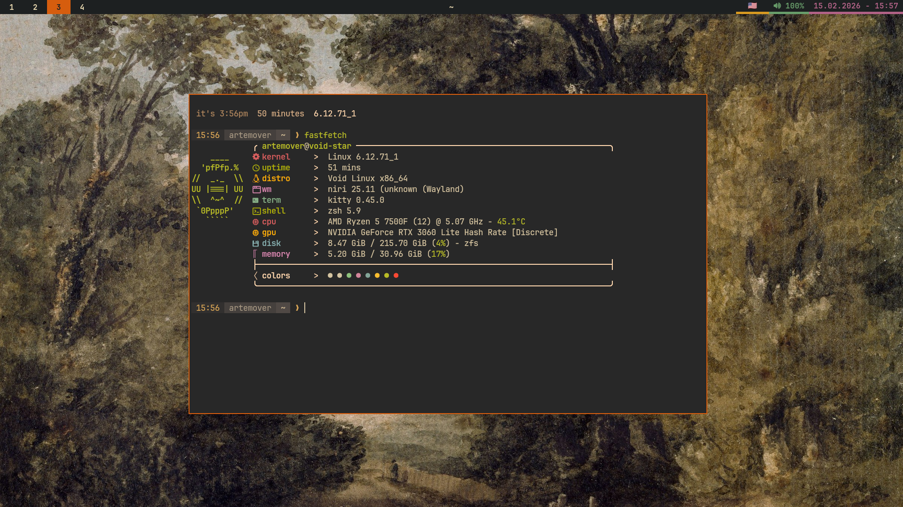
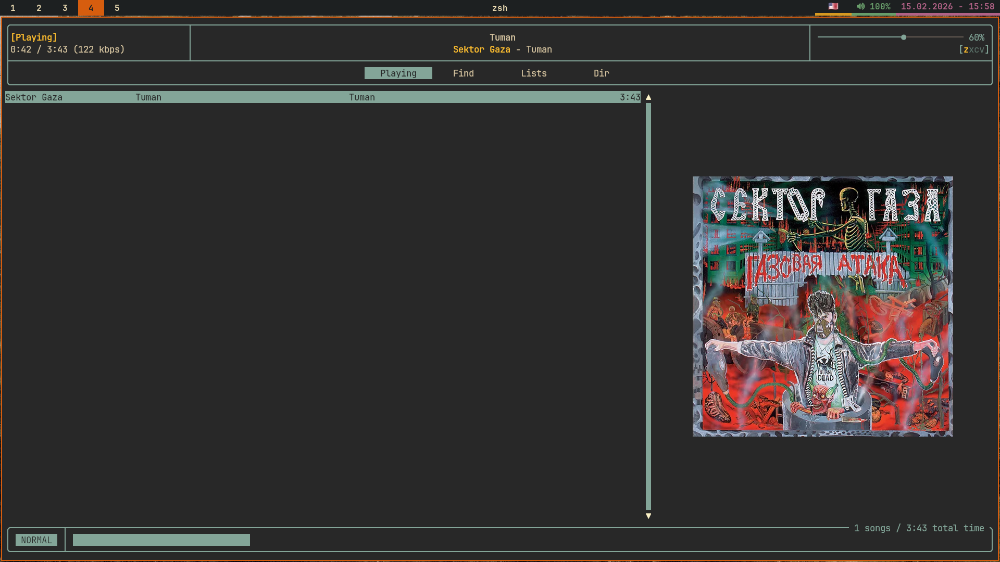

# my main config

 
  

  

# Built with

- **Colorscheme:** [Gruvbox Material](https://github.com/sainnhe/gruvbox-material)

- **WM:** niri

- **Music:** rmpc + mpd

- **Shell:** zsh

- **Terminal:** kitty

- **Utilities:** bat (cat, but better)

- **Info:** fastfetch + btop

- **Launcher:** fuzzel

- **Bar:** waybar

- **File Manager:** yazi (like ranger, but written in Rust)

- **System:** swaync + swaylock + swayidle

- **Telegram:** custom theme to match the setup
